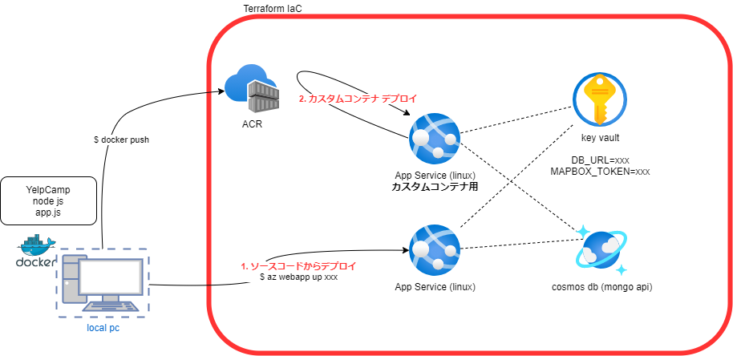

# Azure App Service へデプロイ

想定するデプロイ環境
２種類試します。
1. ソースコードからデプロイ
2. カスタムコンテナを利用したデプロイ


linux(wsl)で作業
```
cat /etc/os-release 
NAME="Ubuntu"
VERSION="20.04.4 LTS (Focal Fossa)"
```

node js 
```
node -v 
v14.18.1
```

## まずは local PC で実行して動作確認
```
npm install
npm run start
```

# Azure へデプロイ
```
RG_NAME=az-yelpcamp-example
az group create -n $RG_NAME -l japaneast
#az group delete -n $RG_NAME
```
## Azure Cosmos DB (Mongo DB)
```
# cosmos account
az cosmosdb create --name yelpcamp-mongodb-account --resource-group $RG_NAME --kind MongoDB --server-version 4.0
# db
az cosmosdb mongodb database create --account-name yelpcamp-mongodb-account --resource-group $RG_NAME --name yelp-camp
```
## App Service (linux)
plan(linux)
```
az appservice plan create -g $RG_NAME -l japaneast -n MyAppServicePlan --is-linux --number-of-workers 1 --sku S1
```

deploy
```
az webapp up -n my-yelpcamp-service -g $RG_NAME -p MyAppServicePlan -l japaneast
```

tail log
```
az webapp log tail -n my-yelpcamp-service -g $RG_NAME
```

ブラウザで動作確認
```
https://my-yelpcamp-service.azurewebsites.net
```

# コンテナ化 (Dockerfile)

version
```
docker -v
Docker version 20.10.17, build 100c701
```

Dockerfile
```
FROM node:14-alpine
WORKDIR /usr/src/app
COPY package*.json ./
RUN npm install
COPY . .
EXPOSE 3000
CMD [ "node", "app.js" ]
```
※npm installで名前解決のエラー(getaddrinfo eai_again registry.npmjs.org)になっていたので dockerが利用するdnsを変更
```
$ sudo cat /etc/docker/daemon.json
{
        "dns": ["8.8.8.8"]
}
```

tagをつける <レジストリ名>.azurecr.io/xxxx:v1
```
docker build . -t myyelpcamp001acr.azurecr.io/yelpcamp-service:v1
```
```
docker images
REPOSITORY                   TAG         IMAGE ID       CREATED         SIZE
tokuyama-test/node-web-app   latest      402651d9d181   2 minutes ago   185MB
node                         14-alpine   798752c1e2a0   3 days ago      119MB
```

ACR(Azure Container Registory) へ push
```
# ACR作成
az acr create --resource-group $RG_NAME --name myyelpcamp001acr --sku Basic
# login
az acr login --name myyelpcamp001acr
```

az acr build -t yelpcamp-service:v1 -r myyelpcamp001acr .

```
# push
docker push myyelpcamp001acr.azurecr.io/yelpcamp-service:v1

# list
az acr repository list --name myyelpcamp001acr --output table
```

## App Service (カスタムコンテナ)
```
# 存在するAppServiceプランを指定して、AppServiceを作成
az webapp create --resource-group $RG_NAME --plan MyAppServicePlan --name my-yelpcamp-cont-service --deployment-container-image-name myyelpcamp001acr.azurecr.io/yelpcamp-service:v1

# WEBSITES_PORTをアプリがListenしているポートに変更
az webapp config appsettings set --resource-group $RG_NAME --name my-yelpcamp-cont-service --settings WEBSITES_PORT=3000
```

システム割り当てマネージドIDを有効
```
az webapp identity assign --resource-group $RG_NAME --name my-yelpcamp-cont-service --query principalId --output tsv
```

マネージドIDにロール(AcrPull) を与えます
```
az role assignment create --assignee <システム割り当てマネージドID> --scope /subscriptions/<サブスクリプションID>/resourceGroups/$RG_NAME/providers/Microsoft.ContainerRegistry/registries/myyelpcamp001acr --role "AcrPull"
```

アプリの構成をACRからPullするように変更
```
az resource update --ids /subscriptions/<サブスクリプションID>/resourceGroups/$RG_NAME/providers/Microsoft.Web/sites/my-yelpcamp-cont-service/config/web --set properties.acrUseManagedIdentityCreds=True
```

イメージをデプロイ
```
az webapp config container set --name my-yelpcamp-cont-service --resource-group $RG_NAME --docker-custom-image-name myyelpcamp001acr.azurecr.io/yelpcamp-service:v1 --docker-registry-server-url https://myyelpcamp001acr.azurecr.io
```

ログを確認
```
az webapp log tail -n my-yelpcamp-cont-service -g $RG_NAME
```


## Azure KeyVault
```
az keyvault create --name "yelpcamp-example-kv" --resource-group $RG_NAME --location "japaneast"
``` 

シークレットの追加 (必要な数だけ追加)
```
az keyvault secret set --vault-name "yelpcamp-example-kv" --name "<xxxxx>" --value "<xxxxx>"
```

App Serviceがアクセスできるようにポリシーを設定
```
az keyvault set-policy --name yelpcamp-example-kv --object-id 0ebc8184-b547-4761-9200-9781f722b786 --secret-permissions get
```

App Serviceの設定
```
@Microsoft.KeyVault(SecretUri=https://yelpcamp-example-kv.vault.azure.net//secrets/ExamplePassword/xxx)
```