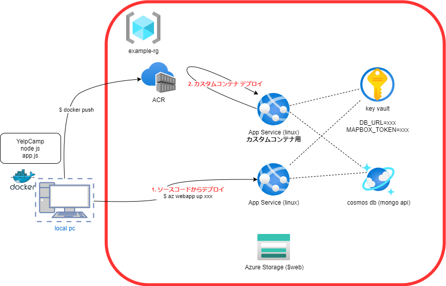

# infra (terraformのサンプル)



この環境をterraformで実装する例

## 作成する Azure リーソース
・Resource Group
・AppService
・Cosmos DB
・Container Registory
・Key Vault

## ファイル構成
```
tree
.
├── README.md
├── locals.tf
├── main.tf ※ここですべて作成しています。
├── output.tf
├── provider.tf
└── variables.tf
```

## terraformコマンド実行
※ tfenvをいれておく
```
tfenv install 1.2.2
tfenv list
tfenv use 1.2.2
```

```
terraform -version
Terraform v1.2.2
on linux_amd64
```

## init, plan, apply, destory

```
terraform init
terraform plan
terraform apply
terraform apply -auto-approve
terraform destory
```
## State File を Azure Storage へ保存する (option)
手順

## input variable と locals

どちらを利用する？　基本的には 内部の変数は locals を利用する。他のモジュールに値を渡したい場合は variable を利用する。

| variable | locals |
| --- | --- |
| 関数が利用できない | 関数が利用できる |
| 外部から値を設定・上書きできる<br>実行時にファイル・環境変数・オプション・対話的入力など。 | 外部から値を設定・上書きできない |
| ... | ... |

## 秘匿情報 (パスワードなど)
外部APIのToken情報など外部からの値を利用したい場合。
環境変数が簡単に利用できて良い。prefixにTF_VAR_をつけるとterraform側で参照できます。

環境変数を定義 (TF_VAR_xxxxx) 
```
export TF_VAR_mapboxapitoken=xxxxtokentokenxxxx
```

variables.tf に同じ名前で変数を定義
```
variable "mapboxapitoken" {
    description = "mapbox api token"
    type = string
    sensitive = true
}
```

main.tf で利用する (var.xxxxx)
```
# MAPBOX_TOKEN を設定
resource "azurerm_key_vault_secret" "example2" {
  name         = "MAPBOXTOKEN"
  value        = var.mapboxapitoken
  key_vault_id = azurerm_key_vault.example.id
}
```

## document

