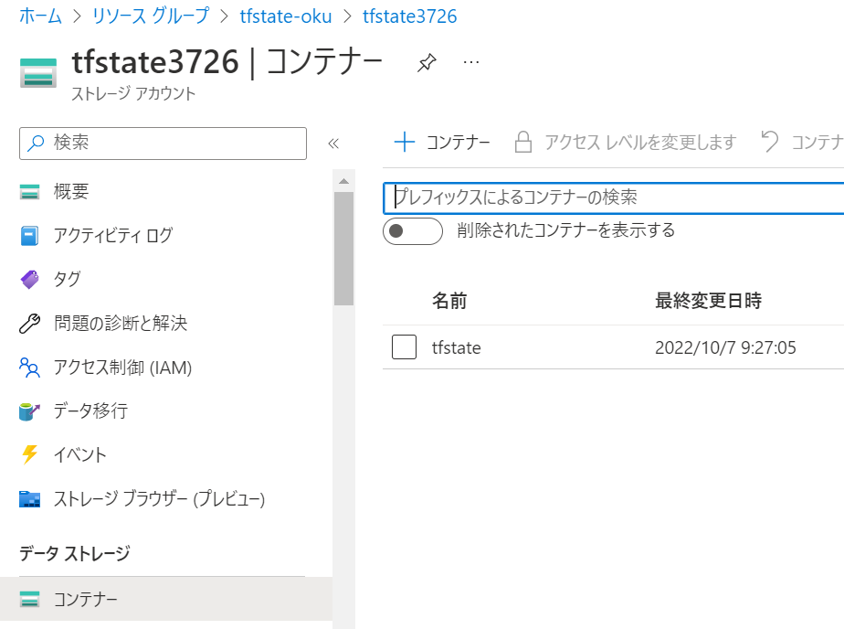
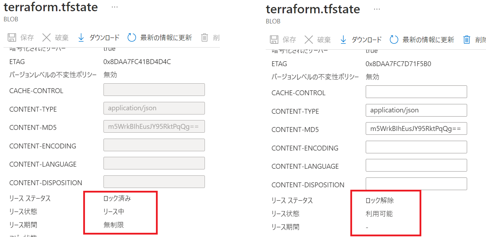

# Terraform 状態を Azure Storage に格納する

[この記事](https://learn.microsoft.com/ja-jp/azure/developer/terraform/store-state-in-azure-storage?tabs=azure-cli)の内容です。

## Storage Accountの作成する
```
#!/bin/bash

RESOURCE_GROUP_NAME=tfstate
STORAGE_ACCOUNT_NAME=tfstate$RANDOM
CONTAINER_NAME=tfstate

# Create resource group
az group create --name $RESOURCE_GROUP_NAME --location japaneast

# Create storage account
az storage account create --resource-group $RESOURCE_GROUP_NAME --name $STORAGE_ACCOUNT_NAME --sku Standard_LRS --encryption-services blob

# Create blob container
az storage container create --name $CONTAINER_NAME --account-name $STORAGE_ACCOUNT_NAME
```

Storage Accountのアクセスキーを取得 (環境変数へ保持)
```
ACCOUNT_KEY=$(az storage account keys list --resource-group $RESOURCE_GROUP_NAME --account-name $STORAGE_ACCOUNT_NAME --query '[0].value' -o tsv)
export ARM_ACCESS_KEY=$ACCOUNT_KEY

#確認
echo $ARM_ACCESS_KEY
xWlwAeTI+h2NFeFZeGfM0PW1WtVhnxxx......
```

※アクセスキー自体の保護については Azure Key Vault を利用することで更にセキュアにすることが可能。

## terraform の backend (provide.tf) として設定
```
terraform {
  required_providers {
    azurerm = {
      source  = "hashicorp/azurerm"
      version = "=2.46.0"
    }
  }
    backend "azurerm" {
        resource_group_name  = "tfstate"
        storage_account_name = "<storage_account_name>"
        container_name       = "tfstate"
        key                  = "terraform.tfstate"
    }
}

provider "azurerm" {
  features {}
}

resource "azurerm_resource_group" "state-demo-secure" {
  name     = "state-demo"
  location = "japaneast"
}
```

terraformを実行し、azure storageを確認すると、状態ファイルが作成されていることが確認できます。
```
terraform init
terraform apply
```


terraformが状態を書き込む操作の前に自動的にロックされ同時に編集されないようになっていることが確認できます。


以上です。